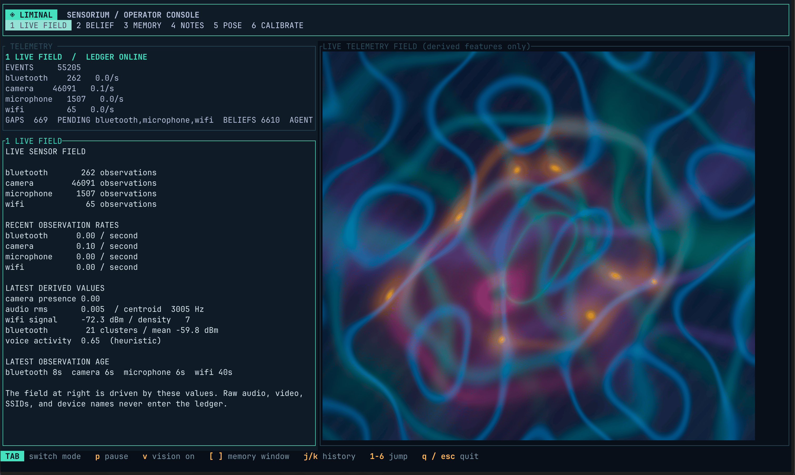

# Liminal

<p align="center">
  
</p>

<h1 align="center">Liminal</h1>

<p align="center">
  <em>Machine perception.</em>
</p>

<p align="center">
  
  
  
  
</p>

<p align="center">
  <a href="#quick-start">Quick start</a> ·
  <a href="#what-it-does">What it does</a> ·
  <a href="#development">Development</a> ·
  <a href="docs/ARCHITECTURE.md">Architecture</a>
</p>

Liminal turns an ordinary Mac into a local sensorium: camera pose, microphone
features, Wi-Fi structure, and Bluetooth proximity become privacy-preserving
derived observations, a transparent occupancy belief, and a readable memory
timeline. Raw video and audio do not enter the ledger.

## See it working



This fresh macOS Terminal capture is from the real launcher and live sensor
path. The ledger was receiving derived observations while it was taken. Live
sensor values control the artwork's intensity and shape; darker regions mean
that a modality is absent or weak, not that raw media is being displayed.

Liminal is a working local prototype, not a finished sensing product. The Rust
ledger, Unix-socket daemon, TUI, privacy boundaries, and Swift feature
extraction are implemented and tested. Long-running calibration, multi-day
memory trials, and production packaging remain open work.

## What it does

- `liminald` owns the canonical SQLite ledger and accepts length-delimited
  Protocol Buffer envelopes over a local Unix socket.
- `liminal-capture` extracts camera pose, acoustic, Wi-Fi, and Bluetooth
  features in Swift. It never persists raw frames, continuous audio, SSIDs,
  BSSIDs, or Bluetooth names.
- `liminal-tui` is the operator surface: `1 LIVE FIELD`, `2 BELIEF`, `3 MEMORY`,
  `4 NOTES`, `5 POSE`, and `6 CALIBRATE`, with read-only history and provenance.
- `liminal-cli` provides privacy audit, explicit gap recovery, provenance
  inspection, offline calibration scoring, memory replay, retention planning,
  export, and confirmation-gated erasure.
- `liminal-schema`, `liminal-policy`, and `liminal-ledger` enforce epistemic
  layers, pseudonymization, retention boundaries, hash-chain integrity, and
  erase-cascade behavior.

## Current state

Working today:

- local Rust workspace and Swift package build cleanly, with the verification
  commands below covering persistence, rendering, feature extraction, IPC,
  pseudonymization, and sequence persistence;
- the TUI remains responsive while its ledger snapshot is loaded in a worker;
- database-lock waits are bounded and daemon startup refuses an active socket
  before removing a stale one.

Experimental or still requiring real trials:

- camera, microphone, Wi-Fi, and Bluetooth delivery depends on macOS hardware,
  permissions, and the current environment;
- occupancy is a transparent first-pass heuristic, not a trained model;
- memory replay and field-note agents are deterministic, local, and auditable,
  but are not evidence of behavior or continuity;
- calibration requires human-labeled trial data.

## Operator modes

The TUI keeps its short labels visible in the top bar:

- `LIVE FIELD` shows derived sensor energy and interference. Cyan/teal
  interference represents acoustic features, slow contour/ripple structure
  represents Wi-Fi, luminous nodes/halos represent Bluetooth, refractive
  distortion represents camera presence or motion, and magenta/rose regions
  represent voice-activity probability. Quiet dark regions mean weak or absent
  evidence. This is a derived telemetry visualization, not a physical scene or
  camera feed.
- `BELIEF` shows the transparent occupancy heuristic: probability, confidence,
  cross-sensor disagreement, freshness/health, and whether evidence is stable
  or contested.
- `MEMORY` shows timestamped temporal lanes for observations and structural
  records. Gaps remain visible; the TUI does not interpolate them.
- `NOTES` shows bounded, read-only ledger facts and provenance-aware drafts.
  Draft text is marked as imagined and is not a claim about behavior.
- `POSE` shows derived Vision joint positions as a skeleton. It never displays
  raw camera frames.
- `CALIBRATE` compares persisted beliefs with an explicitly supplied human
  label file offline. Without labels it reports that calibration is unavailable
  and never retunes the live heuristic.

## Quick start

Requirements: macOS 14 or newer, Rust, Xcode Command Line Tools, and a
terminal that supports the configured TUI rendering protocol.

Liminal owns a full-screen RGB terminal surface. The launcher ignores an
inherited `NO_COLOR` setting so Ghostty and Terminal show the same telemetry
palette. Ghostty uses its Kitty graphics path when the terminal query confirms
support; Halfblocks remains the compatibility fallback. Set
`LIMINAL_IMAGE_PROTOCOL=halfblocks` to force that fallback for diagnostics, or
set `LIMINAL_COLOR=off` when deliberately testing monochrome output.

```bash
# Verify the machine without requesting capture permissions
cd app/Liminal
swift run liminal-doctor --json

# From the repository root: daemon + TUI, with capture disabled
cd ../..
scripts/run-liminal.sh --no-capture
```

The TUI reads the local ledger at
`~/Library/Application Support/Liminal/liminal.db`. Press `q` or `Esc` to
quit. The launcher terminates child processes, bounds shutdown, and cleans its
temporary logs. It leaves socket ownership to the daemon's
owner-aware next startup, so cleanup cannot unlink a socket another daemon has
claimed. The first launch may build Rust and Swift dependencies; subsequent
launches reuse those build products.

To run the full local path, including the Swift capture organ:

```bash
scripts/run-liminal.sh
```

macOS may ask for camera, microphone, and Bluetooth access. Capture is
optional; the daemon and TUI remain useful with `--no-capture` and an existing
ledger.

## Development

```bash
cargo test --workspace -- --test-threads=1
cargo clippy --workspace --all-targets -- -D warnings
python3 checks/mutation_guard.py --manifest checks/mutations.json --assert-min 43

cd app/Liminal
swift build
swift test
swiftformat --lint .
swift run liminal-doctor --json
```

The mutation guard runs one green workspace baseline, then uses the owning
package's suite for each of the 43 handcrafted invariant breaks. If a scoped
suite stays green, it falls back to the full workspace before declaring that
mutation survived. Every mutant must also pass a package compile-only gate;
compiler errors are rejected rather than counted as kills. For a quick local rerun of one failure, add
`--only <mutation-id> --assert-min 1`. CI runs nine isolated package shards
and accepts them only when the aggregate report contains every manifest ID
exactly once and every verdict is `KILLED`.

Useful operator commands:

```bash
cargo run -p liminal-cli -- privacy audit
cargo run -p liminal-cli -- events list
cargo run -p liminal-cli -- memory replay --db /path/to/liminal.db
cargo run -p liminal-cli -- calibration score --db /path/to/liminal.db --labels trial-labels.jsonl
cargo run -p liminal-cli -- retention preview --db /path/to/liminal.db
```

`privacy erase`, retention apply, and gap recovery are explicit operator
actions. They require the relevant confirmation and leave auditable ledger
records; they are not part of the default launch path.

## Architecture

```text
Swift capture organs
  camera pose / acoustic features / Wi-Fi structure / BLE clusters
                         │ length-delimited protobuf over Unix socket
                         ▼
                    liminald
             validate → persist → fuse
                         │
                         ▼
              SQLite hash-chain ledger
                 │                 │
                 ▼                 ▼
             liminal-tui       liminal-cli
             read-only UI       audit / memory / export / recovery
```

The daemon never receives raw media. Fusion records explicit evidence IDs and
decays stale sensor contributions instead of silently treating missing data as
current. The TUI reads snapshots in the background so a slow ledger read does
not block key handling or terminal cleanup.

See [`docs/ARCHITECTURE.md`](docs/ARCHITECTURE.md) for the component contract,
[`ROADMAP.md`](ROADMAP.md) for planned work, and [`AUDIT.md`](AUDIT.md) for
the latest engineering audit and known limitations.

## Repository layout

```text
app/Liminal/          Swift feature extraction, capture organ, and doctor
crates/liminald/      Unix-socket ingest daemon and transparent fusion
crates/liminal-tui/   Primary terminal interface
crates/liminal-cli/   Operator, privacy, memory, and calibration commands
crates/liminal-ledger SQLite event store, hash chain, provenance, and erasure
crates/liminal-policy Privacy sanitization, pseudonyms, retention, anchors
crates/liminal-schema Epistemic layers and sensorium data model
crates/liminal-ipc    Swift↔Rust envelope contract
docs/                 Architecture and captured runtime evidence
checks/               Mutation, coverage, and documentation gates
```
