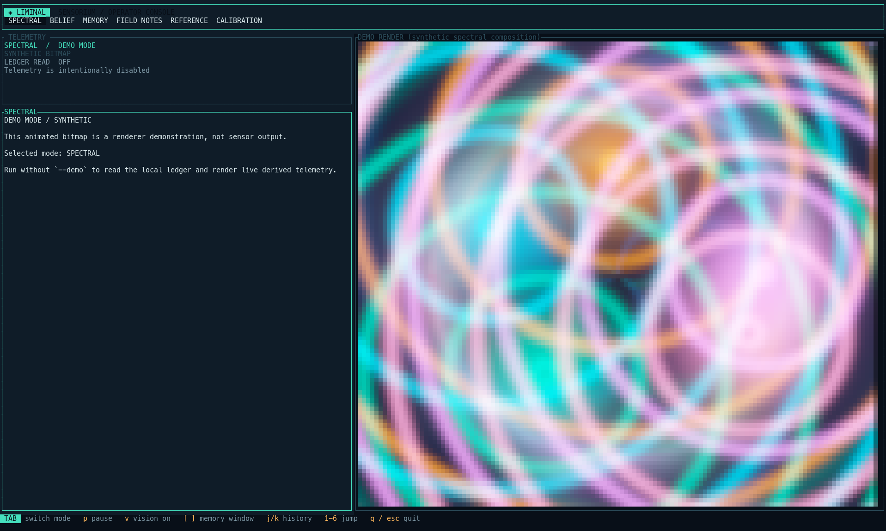
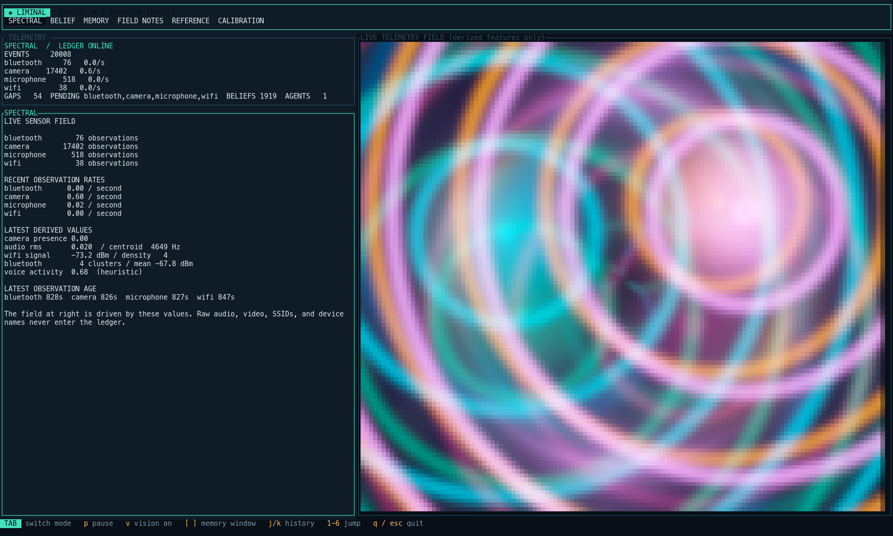

# Liminal

<p align="center">
  
</p>

<h1 align="center">Liminal</h1>

<p align="center">
  <em>Machine perception at the edge of reality.</em>
</p>

<p align="center">
  
  
  
  
</p>

<p align="center">
  <a href="#quick-start">Quick start</a> ·
  <a href="#what-it-does">What it does</a> ·
  <a href="#development">Development</a> ·
  <a href="docs/ARCHITECTURE.md">Architecture</a>
</p>

Liminal turns an ordinary Mac into a local sensorium: camera pose, microphone
features, Wi-Fi structure, and Bluetooth proximity become privacy-preserving
derived observations, a transparent occupancy belief, and a readable memory
timeline. Raw video and audio do not enter the ledger.

## See it working



The explicit `--demo` path uses synthetic values to exercise the same artwork
without reading the ledger. It is a renderer showcase, not sensor evidence.



This real macOS Terminal capture proves the live ledger path and the corrected
full-pane bounding box. Live sensor values control the artwork’s intensity and
shape; darker regions mean that a modality is absent or weak, not that raw media
is being displayed.

Liminal is a working local prototype, not a finished sensing product. The Rust
ledger, Unix-socket daemon, TUI, privacy boundaries, and Swift feature
extraction are implemented and tested. Long-running calibration, multi-day
memory trials, and production packaging remain open work.

## What it does

- `liminald` owns the canonical SQLite ledger and accepts length-delimited
  Protocol Buffer envelopes over a local Unix socket.
- `liminal-capture` extracts camera pose, acoustic, Wi-Fi, and Bluetooth
  features in Swift. It never persists raw frames, continuous audio, SSIDs,
  BSSIDs, or Bluetooth names.
- `liminal-tui` is the operator surface: SPECTRAL, BELIEF, MEMORY, FIELD NOTES,
  REFERENCE, and CALIBRATION modes, with read-only history and provenance.
- `liminal-cli` provides privacy audit, explicit gap recovery, provenance
  inspection, offline calibration scoring, memory replay, retention planning,
  export, and confirmation-gated erasure.
- `liminal-schema`, `liminal-policy`, and `liminal-ledger` enforce epistemic
  layers, pseudonymization, retention boundaries, hash-chain integrity, and
  erase-cascade behavior.

## Current state

Working today:

- local Rust workspace and Swift package build cleanly;
- 45 Rust ledger/daemon tests cover persistence, recovery, locks, provenance,
  gaps, and multi-sensor fusion;
- 56 TUI tests cover mode behavior and rendering paths;
- 59 Swift tests cover feature extraction, IPC framing, pseudonymization, and
  sequence persistence;
- the TUI remains responsive while its ledger snapshot is loaded in a worker;
- database-lock waits are bounded and stale socket cleanup will not unlink an
  active daemon.

Experimental or still requiring real trials:

- camera, microphone, Wi-Fi, and Bluetooth delivery depends on macOS hardware,
  permissions, and the current environment;
- occupancy is a transparent first-pass heuristic, not a trained model;
- memory replay and field-note agents are deterministic, local, and auditable,
  but are not evidence of behavior or continuity;
- calibration requires human-labeled trial data.

## Quick start

Requirements: macOS 14 or newer, Rust, Xcode Command Line Tools, and a
terminal that supports the configured TUI rendering protocol.

Liminal owns a full-screen RGB terminal surface. The launcher ignores an
inherited `NO_COLOR` setting so Ghostty and Terminal show the same telemetry
palette. Ghostty uses its Kitty graphics path when the terminal query confirms
support; Halfblocks remains the compatibility fallback. Set
`LIMINAL_IMAGE_PROTOCOL=halfblocks` to force that fallback for diagnostics, or
set `LIMINAL_COLOR=off` when deliberately testing monochrome output.

```bash
# Verify the machine without requesting capture permissions
cd app/Liminal
swift run liminal-doctor --json

# From the repository root: daemon + TUI, with capture disabled
cd ../..
scripts/run-liminal.sh --no-capture
```

The TUI reads the local ledger at
`~/Library/Application Support/Liminal/liminal.db`. Press `q` or `Esc` to
quit. The launcher terminates child processes, bounds shutdown, removes only a
stale socket, and cleans its temporary logs.

To run the full local path, including the Swift capture organ:

```bash
scripts/run-liminal.sh
```

macOS may ask for camera, microphone, and Bluetooth access. Capture is
optional; the daemon and TUI remain useful with `--no-capture` and an existing
ledger.

For a deliberately synthetic renderer check, use the explicitly labeled demo:

```bash
cargo run -p liminal-tui -- --demo --demo-frames 10
```

The demo never reads or displays ledger data and must not be used as evidence
that live sensors are connected.

## Development

```bash
cargo test --workspace -- --test-threads=1
cargo clippy --workspace --all-targets -- -D warnings
python3 checks/mutation_guard.py --manifest checks/mutations.json --assert-min 43

cd app/Liminal
swift build
swift test
swiftformat --lint .
swift run liminal-doctor --json
```

Useful operator commands:

```bash
cargo run -p liminal-cli -- privacy audit
cargo run -p liminal-cli -- events list
cargo run -p liminal-cli -- memory replay --db /path/to/liminal.db
cargo run -p liminal-cli -- calibration score --db /path/to/liminal.db --labels trial-labels.jsonl
cargo run -p liminal-cli -- retention preview --db /path/to/liminal.db
```

`privacy erase`, retention apply, and gap recovery are explicit operator
actions. They require the relevant confirmation and leave auditable ledger
records; they are not part of the default launch path.

## Architecture

```text
Swift capture organs
  camera pose / acoustic features / Wi-Fi structure / BLE clusters
                         │ length-delimited protobuf over Unix socket
                         ▼
                    liminald
             validate → persist → fuse
                         │
                         ▼
              SQLite hash-chain ledger
                 │                 │
                 ▼                 ▼
             liminal-tui       liminal-cli
             read-only UI       audit / memory / export / recovery
```

The daemon never receives raw media. Fusion records explicit evidence IDs and
decays stale sensor contributions instead of silently treating missing data as
current. The TUI reads snapshots in the background so a slow ledger read does
not block key handling or terminal cleanup.

See [`docs/ARCHITECTURE.md`](docs/ARCHITECTURE.md) for the component contract,
[`ROADMAP.md`](ROADMAP.md) for planned work, and [`AUDIT.md`](AUDIT.md) for
the latest engineering audit and known limitations.

## Repository layout

```text
app/Liminal/          Swift feature extraction, capture organ, and doctor
crates/liminald/      Unix-socket ingest daemon and transparent fusion
crates/liminal-tui/   Primary terminal interface
crates/liminal-cli/   Operator, privacy, memory, and calibration commands
crates/liminal-ledger SQLite event store, hash chain, provenance, and erasure
crates/liminal-policy Privacy sanitization, pseudonyms, retention, anchors
crates/liminal-schema Epistemic layers and sensorium data model
crates/liminal-ipc    Swift↔Rust envelope contract
docs/                 Architecture and captured runtime evidence
checks/               Mutation, coverage, and documentation gates
```
