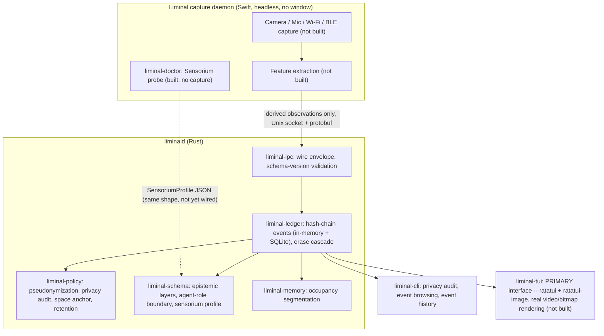

# Architecture

Full rationale: [`LIMINAL_MASTER_PLAN.md`](../LIMINAL_MASTER_PLAN.md). This
document tracks the architecture of what is actually built.

## Target runtime shape (revised 2026-08-26 — TUI-primary)

The master plan's original D014 ("native visual app is first-class") is
superseded, at the user's direction — see `ROADMAP.md`'s "Update
2026-08-26" section for the full rationale. Swift no longer owns a windowed
app; it's a **headless capture daemon**. The Rust TUI is the primary
interface, rendering real bitmap/video via the Kitty graphics protocol
(confirmed supported by the user's terminal, Ghostty 1.3.1) through
`ratatui-image`, not ASCII-art approximation. Swift and Rust still talk
over a Unix domain socket via Protocol Buffers (§15) exactly as before;
raw camera frames and raw microphone PCM still never cross that boundary —
only this diagram's shape changed, not the privacy posture.



## What exists today

The canonical-state core, its wire contract, and a first Swift probe exist
so far:

- **`crates/liminal-schema`** — the four epistemic layers (OBSERVED,
  INFERRED, INTERPRETED, IMAGINED) and the hard boundary between them: no
  IMAGINED artifact may back a factual claim, and each agent role
  (Archivist, Ethnographer, Skeptic, Cartographer, Poet) can only author
  claims in its permitted layer. Also carries `SensoriumProfile` (§22): the
  data shape a future Swift probe will report hardware capabilities into.
- **`crates/liminal-memory`** — Observation → Event segmentation (§58):
  hysteresis-based occupancy transitions with gap merging, over a synthetic
  probability time series. Not yet wired to a live belief stream.
- **`crates/liminal-policy`** — HMAC-SHA256 pseudonymization for BLE
  identifiers, Wi-Fi Mode A sanitization (aggregate features only, no
  SSID/BSSID field exists on the output type), a recursive privacy-audit
  scanner for forbidden keys, space-anchor divergence handling that caps
  belief confidence when the laptop appears to have moved, and the §85
  retention-tier eligibility function (pure decision logic, not wired to an
  actual deletion scheduler yet).
- **`crates/liminal-ledger`** — an append-only, BLAKE3 hash-chained event
  log with two implementations: an in-memory `Ledger` (the original) and a
  SQLite-backed `SqliteLedger` (persisted, with a migration and
  crash-recovery test). A separate in-memory `ProvenanceGraph` cascades
  invalidation from an erased source to every downstream
  Event/Episode/Pattern/Interpretation; it is not connected to
  `SqliteLedger`'s persisted storage (see "Known architectural gap" below).
  A sensor-gap guard refuses to record belief across an unacknowledged
  sensor outage, on both ledger implementations.
- **`crates/liminal-ipc`** — the Swift↔Rust wire contract: a Protocol
  Buffers envelope (§15) matching the exact field list the plan specifies,
  with schema-version rejection (§119) so a mismatched build can't silently
  desync. No transport (reconnect, dedup, backpressure) yet — that's a
  `liminald` runtime concern, not this crate's.
- **`crates/liminal-cli`** — the `liminal` binary's data-layer-only
  subcommands: `privacy audit` (scans a `SqliteLedger`'s stored records for
  forbidden keys), `events list`/`show`, and `events history <id>` (walks
  `SqliteLedger`'s `previous_hash` chain back to genesis — an append-order/
  integrity view, explicitly NOT a provenance/derivation query; it was
  originally named `explain` and framed as §62 provenance drilldown, then
  renamed after review caught that mismatch — see the gap note below).
- **`app/Liminal`** — a Swift package: `LiminalCore` (a testable library —
  the `SensoriumProfile`/`SensorState` Codable types mirroring
  `liminal-schema`'s Rust types field-for-field, plus hashing) and
  `liminal-doctor` (the §21/§117 `liminal doctor` / `liminal doctor --json`
  CLI, a thin wrapper over `LiminalCore`'s hardware probes). It reads real
  camera format/resolution, microphone sample rate, Wi-Fi interface state,
  and Bluetooth authorization/power state on the machine it runs on — but
  it never opens an `AVCaptureSession`, taps microphone audio, scans Wi-Fi
  networks, or starts a BLE scan, so it requests zero permission prompts.
  See "TCC and unsigned CLI binaries" below before building anything past
  this probe.

Everything else in the master plan — Sensorium discovery's live acceptance
mode, the full permission shell, actual sensor capture (camera Vision pose,
audio taps, Wi-Fi/BLE scanning), calibration, fusion, the Spectral Canvas,
the TUI, field-note agents — is `PLANNED`. See [`ROADMAP.md`](../ROADMAP.md)
for the proposed build order and [`AUDIT.md`](../AUDIT.md) for the full
feature-by-feature status.

## TCC and unsigned CLI binaries

`liminal-doctor` is an unsigned Swift Package Manager executable, not a
signed `.app` bundle. On macOS, an unsigned CLI tool invoked from a
terminal does not get its own TCC (privacy permission) identity — the OS
attributes camera/microphone/Bluetooth authorization checks to whatever
process hosts it (observed directly during development: `AVCaptureDevice
.authorizationStatus(for: .audio)` returned `available` because the host
terminal already had microphone access granted, not because
`liminal-doctor` itself had been granted anything).

This is fine for `liminal-doctor`'s current scope (it only ever *reads*
authorization state, never requests it), but it means the next milestone —
actually requesting camera/microphone/Bluetooth access and having macOS
prompt the user by *Liminal's* name, not the terminal's — requires
Liminal.app to be a properly code-signed application bundle with its own
bundle identifier and Info.plist usage-description strings (§90/§118).
Building that permission shell as another SPM executable would silently
attribute every grant to the terminal instead of to Liminal, which is
exactly the "no hidden sensing" violation §3/§14 exist to prevent.

## Known architectural gap: two disconnected provenance mechanisms

`liminal-ledger` currently has two ways to answer "what does this claim
depend on":

1. `ProvenanceGraph` — an explicit dependency DAG (`add_node(id,
   depends_on)`) with cascading erase-invalidation. Built for and only
   exercised by that crate's own tests; nothing persists a `depends_on`
   edge into SQLite.
2. `SqliteLedger`'s `previous_hash` chain — every persisted `Event` already
   links to its predecessor. `liminal-cli`'s `events history <id>` walks
   this chain, which is real persisted data, but it's the GLOBAL APPEND
   ORDER (an integrity mechanism, §87), not a derivation graph: an
   unrelated event from a different stream, appended between two related
   ones, appears in the history exactly as if it were evidence. It is not
   the branching dependency graph `ProvenanceGraph` models (an Event can
   only have one predecessor in the chain; the plan's real provenance
   model, §62, is Observation → Event → Episode → Pattern →
   Interpretation, a many-to-one fan-in `ProvenanceGraph` is built for).

These are not yet reconciled. Building Episodes/Patterns/Interpretations
(out of scope for every task built so far) will need one coherent,
persisted provenance mechanism — deciding whether that's a
`depends_on`-edges table replacing `ProvenanceGraph`, or something else, is
a design decision for whoever picks up that work, not something to guess at
here.

## Why these crates first

The master plan's fixed development order (§177) starts with the
constitution and sensor discovery, but the constitution's actual
enforcement mechanism — the privacy and epistemic invariants — has no
hardware dependency at all. Building and mutation-testing that layer first
means every later crate (fusion, memory, agents) is built on top of
boundaries that are already proven to hold, rather than proven later by
inspection.

## Testing

```bash
cargo test --workspace
cargo clippy --workspace --all-targets -- -D warnings
python3 checks/mutation_guard.py --manifest checks/mutations.json --assert-min 11
python3 checks/coverage_gate.py --manifest checks/mutations.json --report target/lcov.info
```

CI (`.github/workflows/ci.yml`) runs all four on every push and pull
request, plus `checks/docs_gate.py` against this file and the README.
