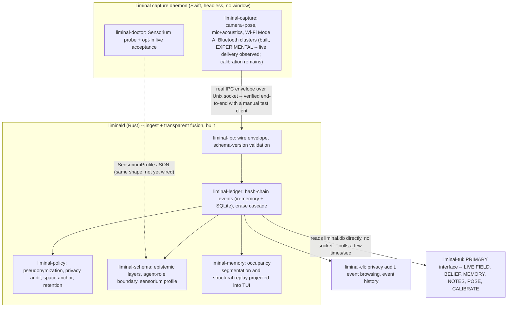

# Architecture

Full rationale: [`LIMINAL_MASTER_PLAN.md`](../LIMINAL_MASTER_PLAN.md). This
document tracks the architecture of what is actually built.

## Target runtime shape (revised 2026-08-26 — TUI-primary)

The master plan's original D014 ("native visual app is first-class") is
superseded, at the user's direction — see `ROADMAP.md`'s "Update
2026-08-26" section for the full rationale. Swift no longer owns a windowed
app; it's a **headless capture daemon**. The Rust TUI is the primary
interface, rendering real bitmap/video via the Kitty graphics protocol
(confirmed supported by the user's terminal, Ghostty 1.3.1) through
`ratatui-image`, not ASCII-art approximation. Swift and Rust still talk
over a Unix domain socket via Protocol Buffers (§15) exactly as before;
raw camera frames and raw microphone PCM still never cross that boundary —
only this diagram's shape changed, not the privacy posture.



## What exists today

The canonical-state core, its wire contract, and a first Swift probe exist
so far:

- **`crates/liminal-schema`** — the four epistemic layers (OBSERVED,
  INFERRED, INTERPRETED, IMAGINED) and the hard boundary between them: no
  IMAGINED artifact may back a factual claim, and each agent role
  (Archivist, Ethnographer, Skeptic, Cartographer, Poet) can only author
  claims in its permitted layer. Also carries `SensoriumProfile` (§22): the
  data shape a future Swift probe will report hardware capabilities into.
- **`crates/liminal-memory`** — Observation → Event segmentation (§58):
  hysteresis-based occupancy transitions with gap merging, plus deterministic
  read-only Event → Episode → Pattern replay projected from daemon fusion
  beliefs into the TUI. It also provides an offline calibration evaluator
  for explicit occupancy labels; it does not manufacture labels from sensor
  observations or retune the live heuristic. The daemon's belief stream is
  projected into the TUI as read-only occupancy Events.
- **`crates/liminal-policy`** — HMAC-SHA256 pseudonymization for BLE
  identifiers, Wi-Fi Mode A sanitization (aggregate features only, no
  SSID/BSSID field exists on the output type), a recursive privacy-audit
  scanner for forbidden keys, space-anchor divergence handling that caps
  belief confidence when the laptop appears to have moved, and the §85
  retention-tier eligibility function (pure decision logic, not wired to an
  actual deletion scheduler yet).
- **`crates/liminal-ledger`** — an append-only, BLAKE3 hash-chained event
  log with two implementations: an in-memory `Ledger` (the original) and a
  SQLite-backed `SqliteLedger` (persisted, with a migration and
  crash-recovery test). A separate in-memory `ProvenanceGraph` cascades
  invalidation from an erased source to every downstream
  Event/Episode/Pattern/Interpretation; it is not connected to
  `SqliteLedger`'s persisted storage (see the provenance boundary below).
  A sensor-gap guard refuses to record belief across an unacknowledged
  sensor outage, on both ledger implementations.
- **`crates/liminal-ipc`** — the Swift↔Rust wire contract: a Protocol
  Buffers envelope (§15) matching the exact field list the plan specifies,
  with schema-version rejection (§119) so a mismatched build can't silently
  desync. Replayed message IDs are idempotent at ingest, so reconnects do not
  duplicate observations or fusion beliefs. `liminald` also records explicit
  sensor gaps for forward monotonic-sequence jumps and rejects frames above its
  1 MiB allocation bound. A 16-slot synchronous connection queue applies
  backpressure before worker creation can become unbounded.
- **`crates/liminal-cli`** — the `liminal` binary's data-layer-only
  subcommands: `privacy audit` (scans a `SqliteLedger`'s stored records for
  forbidden keys and the canonical debug-captures directory for raw media),
  `events list`/`show`, `events provenance <id>` and
  `events provenance-tree <id>` (read explicit source edges), and
  `privacy erase --since-us ... --until-us ... --confirm` (explicitly remove a
  timestamp range and cascade to its dependents), and
  `events history <id>` (walks
  `SqliteLedger`'s `previous_hash` chain back to genesis — an append-order/
  integrity view, explicitly NOT a provenance/derivation query; it was
  originally named `explain` and framed as §62 provenance drilldown, then
  renamed after review caught that mismatch — see the gap note below). It also
  provides `calibration score` for explicit labels and
  `recovery acknowledge-gaps` for reviewed sensor outages; recovery appends
  auditable acknowledgment events and never erases or silently bridges
  history.
- **`crates/liminald`** — the ingest and first-pass fusion daemon. It validates
  envelopes, persists derived observations, and appends a `fusion` belief record
  containing only explainable probability/confidence/disagreement features,
  freshness-weighted sensor health, and an explicit stable/contested state when
  the participating sensor streams have no unacknowledged gap. Stale inputs
  decay out rather than remaining authoritative. It never reads raw media.
  Prepares the §15 socket path (0700 directory, 0600 socket file — one of
  its two mutation-guarded invariants), binds a `UnixListener`, and for each
  connection decodes length-delimited `liminal-ipc` envelopes, validates
  their schema version, and persists them via
  `SqliteLedger::append_observation_with_features` (a new method added
  alongside this crate, since the existing `append_observation` discarded
  everything but `stream_id`/`ts_us` — real sensor features need to survive
  ingest). It then appends a transparent `fusion` belief record when the
  participating streams have no unacknowledged gap. Verified end-to-end for
  real: `crates/liminald/examples/send_test_envelope.rs`
  connects over a real Unix socket and the resulting SQLite row was
  inspected directly (not just asserted in a test) during development.
- **`crates/liminal-tui`** — the primary interface (2026-08-26 pivot, above):
  six operator modes (`LIVE FIELD`, `BELIEF`, `MEMORY`, `NOTES`, `POSE`, and `CALIBRATE`, §72) with
  `ratatui-image` proven to render real animated bitmap output over the
  terminal's graphics protocol (Kitty/Sixel, auto-detected; halfblock
  fallback otherwise). Now reads `liminal-ledger`'s real SQLite store
  directly (polling `default_db_path()`, no socket — the TUI and `liminald`
  are both just readers/writers of the same file): capture allocates monotonic
  IPC sequence numbers independently per sensor stream, so interleaved
  camera/audio/radio delivery does not create false cross-stream gaps. The
  allocator persists counters atomically in the local Liminal application
  support directory, so a capture restart cannot reset a stream and later
  manufacture a forward sequence gap.
  LIVE FIELD turns the latest acoustic, Wi-Fi, and Bluetooth derived feature
  values into a live bitmap field and reports recent per-stream observation
  rates from timestamp spans. Cyan/teal interference maps to acoustic
  features, slow contours/ripples to Wi-Fi, luminous nodes/halos to Bluetooth,
  refractive distortion to camera presence/motion, and magenta/rose to VAD;
  quiet dark regions mean weak or absent evidence. These are derived telemetry
  families, not a physical-scene reconstruction. BELIEF applies a transparent
  first-pass heuristic to
  camera presence, acoustic activity, and Bluetooth proximity, exposing
  confidence and cross-modality disagreement rather than presenting a
  trained-classifier claim; POSE renders a real skeleton from the most recent
  `liminal-capture` pose observation when one exists, and MEMORY mode shows
  a recent timestamped observation timeline with sensor streams separated and
  gaps left unfilled; it also exposes a bounded newest-first historical record
  browser of the newest 32 persisted records with explicit provenance source IDs. The operator can use `j`/`k`
  or the arrow keys to inspect records without mutating the ledger, and can
  widen the in-memory window with `]`
  and narrow it with `[`. It also reports compact populated-day buckets from the
  full ledger, preserving empty days as gaps rather than interpolating them.
  NOTES is a read-only provenance surface: it reports ledger facts,
  daemon-belief evidence IDs, bounded persisted Tier-0 agent drafts with their
  stored layer and review status, and system limitations, while marking the Poet's
  text as IMAGINED and withholding uncalibrated conclusions. When no real data has arrived yet,
  the image falls back to an explicitly-labeled synthetic demo pattern
  (§146 Demo Honesty); `liminal-tui --demo` also forces that path so the
  renderer can be exercised independently of database state. Correction
  to the original ROADMAP.md wording for this item, recorded in
  `crates/liminal-tui/src/ledger_view.rs`'s module doc: it described a "live camera frame"
  reference view, which would require a raw frame in the ledger — §120 and
  the Swift↔Rust contract both forbid that, so a skeleton derived from real
  joint data is shown instead, never camera pixels.
  CALIBRATE is an offline score view: it accepts an optional JSONL file of
  human or approved reference labels, matches those labels to persisted fusion
  beliefs, and reports metrics without changing the live heuristic. Without
  labels it explicitly reports that calibration is unavailable.
- **`app/Liminal`** — a Swift package: `LiminalCore` (a testable library —
  the `SensoriumProfile`/`SensorState` Codable types mirroring
  `liminal-schema`'s Rust types field-for-field, plus hashing) and
  `liminal-doctor` (the §21/§117 `liminal doctor` / `liminal doctor --json`
  CLI, a thin wrapper over `LiminalCore`'s hardware probes). It reads real
  camera format/resolution, microphone sample rate, Wi-Fi interface state,
  and Bluetooth authorization/power state on the machine it runs on. By
  default it never opens an `AVCaptureSession`, taps microphone audio, scans
  Wi-Fi networks, or starts a BLE scan, so it requests zero permission
  prompts. Its explicit `--live --duration=N` mode runs the real coordinators
  for a bounded window and reports only derived sample counts/statuses; it
  never writes an acceptance artifact or returns raw media. A live run on
  this Mac observed camera, microphone, and Wi-Fi samples plus available
  speaker output; Bluetooth may report a Keychain-backed pseudonym-key
  failure. The acceptance window separately counts transient CoreBluetooth
  discovery callbacks, without retaining identifiers, so it can distinguish
  `no_advertisers_observed` from `advertisers_detected_keychain_unavailable`.
  It must not be interpreted as proof that no Bluetooth advertisers exist when
  the scan is not authorized or the radio is unavailable.
  See "TCC and unsigned CLI binaries" below before building anything past
  this probe. The package also has `liminal-capture`, now covering ROADMAP
  items 2 and 5:
  - **Vision organ** (§120): requests camera authorization explicitly (§90),
    then uses `VisionCaptureCoordinator` (`AVCaptureSession` +
    `VNDetectHumanBodyPoseRequest`) to extract 2D body pose per frame.
  - **Passive acoustic organ** (§26/§27): requests microphone authorization
    separately (its own §90 explanation, not bundled with the camera one),
    then `AudioCaptureCoordinator` taps the input node and aggregates ~1s
    windows into RMS/peak/zero-crossing-rate/spectral-centroid/spectral-
    rolloff/spectral-flatness features via a real FFT (Accelerate `vDSP`,
    Hann-windowed — an unwindowed FFT was tried first and biased a pure
    1000Hz tone's measured centroid to ~2555Hz via sidelobe leakage; this
    was caught by the tone-frequency test itself, not assumed correct).
    `voice_activity_probability` is an explicit three-factor heuristic
    (energy + ZCR band + spectral non-flatness), not a trained model — §28
    only permits using it to suppress active probes and inform privacy UI,
    which is exactly the level of rigor that scope justifies (§47). No
    MFCC anywhere, matching §27's "disabled by default" boundary.

  - **Wi-Fi organ** (§34/§37, Mode A only): `WifiScanCoordinator` calls
    `CWInterface.scanForNetworks` every 45s (§35's 30-60s window) and pipes
    results through `sanitizeWifiModeA` — the exact same aggregate-only
    logic as `liminal_policy::sanitize_wifi_mode_a` on the Rust side,
    ported deliberately so both languages agree on what "Mode A" means.
    `WifiObservationModeA` has no SSID/BSSID field to leak one into; the
    scan-result mapping code never even reads the network's SSID field.
    Requires no
    permission prompt (confirmed by `liminal-doctor`'s earlier probing).
  - **Bluetooth organ** (§38/§39/§40): `BluetoothScanCoordinator` scans
    continuously with duplicates allowed, pseudonymizing every
    `CBPeripheral.identifier` via HMAC immediately on discovery — the raw
    UUID is never held past that one callback. The HMAC key is
    Keychain-persisted (§18's `pseudonym_hmac_key` entry, via
    `app/Liminal/Sources/LiminalCore/PseudonymKeyStore.swift`) rather than
    random-per-process, so the same
    peripheral pseudonymizes to the same value across restarts (required
    for §39/§40's "recurring proximity cluster" to mean anything). Checks
    `CBCentralManager.authorization` and explains before the OS prompts.

  All four organs emit `liminal-ipc` envelopes over the same Unix socket
  (or stdout fallback) via one shared send path, and none persists any raw
  frame, raw continuous audio, SSID/BSSID, or Bluetooth device name to
  disk. The DSP, sanitization, and pseudonymization logic is unit-tested
  (the Swift verification suite across the core and capture support, including a
  privacy-audit-style test that Wi-Fi/Bluetooth JSON literally cannot
  contain the raw strings that went in). The bounded live acceptance path has
  now observed camera, microphone, and Wi-Fi delivery plus speaker
  availability on the development Mac; Bluetooth reported three transient
  advertiser discoveries but remains unable to emit derived features when its
  Keychain-backed pseudonym key cannot be loaded. The Keychain-backed
  pseudonym key storage specifically is not unit-tested at
  all (CI can't guarantee an unlocked, writable login keychain); only the
  HMAC function it feeds is.

The remaining master-plan gaps are the signed permission shell, human-labeled
calibration trials, persisted
field-note claims, and multi-day trials. The current TUI fusion, memory
coverage, and read-only field-note surfaces are explicitly experimental or
provenance-safe as described above. See [`ROADMAP.md`](../ROADMAP.md) for the
current build order and [`AUDIT.md`](../AUDIT.md) for the feature-by-feature
status.

## TCC and unsigned CLI binaries

`liminal-doctor` is an unsigned Swift Package Manager executable, not a
signed `.app` bundle. On macOS, an unsigned CLI tool invoked from a
terminal does not get its own TCC (privacy permission) identity — the OS
attributes camera/microphone/Bluetooth authorization checks to whatever
process hosts it (observed directly during development: `AVCaptureDevice
.authorizationStatus(for: .audio)` returned `available` because the host
terminal already had microphone access granted, not because
`liminal-doctor` itself had been granted anything).

This is fine for `liminal-doctor`'s current scope (it only ever *reads*
authorization state, never requests it), but it means the next milestone —
actually requesting camera/microphone/Bluetooth access and having macOS
prompt the user by *Liminal's* name, not the terminal's — requires
Liminal.app to be a properly code-signed application bundle with its own
bundle identifier and Info.plist usage-description strings (§90/§118).
Building that permission shell as another SPM executable would silently
attribute every grant to the terminal instead of to Liminal, which is
exactly the "no hidden sensing" violation §3/§14 exist to prevent.

## Provenance boundary: explicit edges and append-order integrity

`liminal-ledger` has distinct mechanisms for derivation and append-order
integrity:

1. `SqliteLedger`'s `provenance_edges` table — explicit `derived_id` to
   `source_id` edges are written atomically with derived events and survive
   close/reopen. `liminal events provenance <id>` reads these edges.
2. `ProvenanceGraph` — an explicit in-memory dependency DAG (`add_node(id,
   depends_on)`) with cascading erase-invalidation. `SqliteLedger::erase_event_ids`
   applies the same cascade durably for the explicit CLI `privacy erase` range
   operation and rebuilds the surviving hash chain transactionally.
3. `SqliteLedger`'s `previous_hash` chain — every persisted `Event` already
   links to its predecessor. `liminal-cli`'s `events history <id>` walks
   this chain, which is real persisted data, but it's the GLOBAL APPEND
   ORDER (an integrity mechanism, §87), not a derivation graph: an
   unrelated event from a different stream, appended between two related
   ones, appears in the history exactly as if it were evidence. It is not
   the branching dependency graph `ProvenanceGraph` models (an Event can
   only have one predecessor in the chain; the plan's real provenance
   model, §62, is Observation → Event → Episode → Pattern →
   Interpretation, a many-to-one fan-in `ProvenanceGraph` is built for).

The explicit edge table is now the durable source-link mechanism for derived
events. `liminal memory replay` materializes deterministic Episode/Pattern
records on explicit operator request, atomically with their source edges and
without interpretation claims. The TUI still falls back to a read-only replay
when those records have not been materialized.

`liminal agents run <role>` is the first Tier-0 agent boundary. It consumes
only persisted fusion beliefs and structural memory records, writes a local
  `agent_run` record with explicit input/evidence IDs and provenance edges, and
stamps the output layer and review status. It refuses to persist without
structured evidence. Ethnographer and Skeptic outputs remain
`PENDING_INTERPRETATION` or `INSUFFICIENT_EVIDENCE`; Poet output is always
`IMAGINED`.

`liminal export` writes an explicit local JSON bundle only after scanning every
selected payload for forbidden keys. It preserves hash fields and provenance
sources, supports timestamp ranges, and performs no deletion or network I/O.

## Why these crates first

The master plan's fixed development order (§177) starts with the
constitution and sensor discovery, but the constitution's actual
enforcement mechanism — the privacy and epistemic invariants — has no
hardware dependency at all. Building and mutation-testing that layer first
means every later crate (fusion, memory, agents) is built on top of
boundaries that are already proven to hold, rather than proven later by
inspection.

## Testing

```bash
cargo test --workspace
cargo clippy --workspace --all-targets -- -D warnings
python3 checks/mutation_guard.py --manifest checks/mutations.json --assert-min 43
python3 checks/coverage_gate.py --manifest checks/mutations.json --report target/lcov.info
```

CI (`.github/workflows/ci.yml`) runs all four on every push and pull
request, plus `checks/docs_gate.py` against this file and the README. Mutation
verification keeps the full workspace as its baseline and fallback, but runs
the known killing package suite first after proving the mutant compiles. Nine disposable CI checkouts execute
the package scopes concurrently; a final verifier rejects missing, duplicate,
unknown, stale, timed-out, surviving, mixed-commit, or mixed-manifest results.
`liminal export` writes an explicit local JSON bundle only after scanning every
selected payload for forbidden keys. It preserves hash fields and provenance
sources, supports timestamp ranges, and performs no deletion or network I/O.
`liminal retention preview` applies the canonical age policy as a report-only
operation; structural Episode/Pattern/agent records are explicitly protected
from age-based candidates. `liminal retention plan` emits the exact eligible
record IDs, timestamps, and provenance sources as a reviewable JSON plan.
`liminal retention apply` is the confirmation-gated executor for that plan;
preview and plan remain read-only. `privacy erase` is the separate, explicit
`--confirm` operation that may delete a selected range and its dependent
records. No retention worker may delete from the canonical ledger implicitly.
