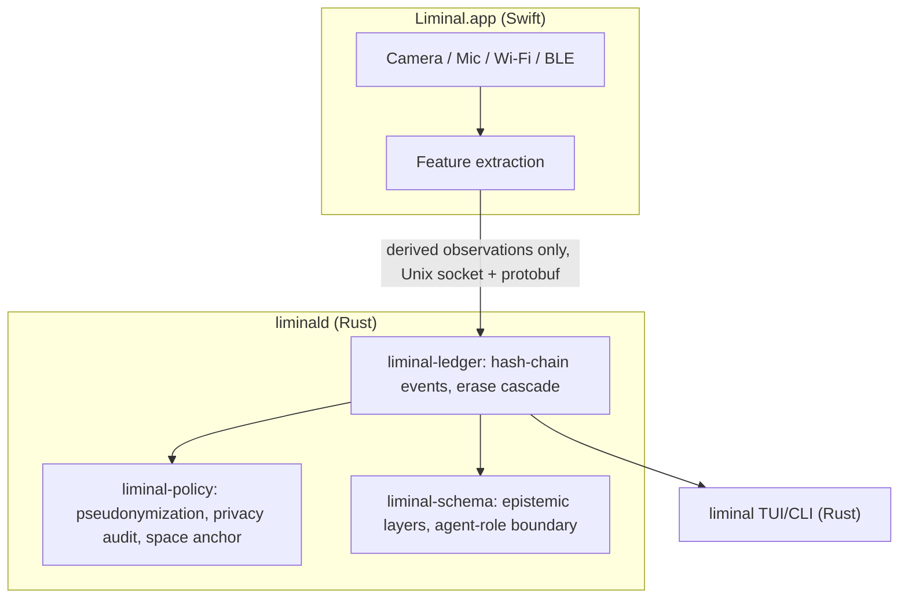

# Architecture

Full rationale: [`LIMINAL_MASTER_PLAN.md`](../LIMINAL_MASTER_PLAN.md). This
document tracks the architecture of what is actually built.

## Target runtime shape (planned)

The plan splits Liminal into three processes: a Swift GUI (Liminal.app)
that owns protected sensors and TCC permissions, a Rust daemon (`liminald`)
that owns canonical state, and a Rust TUI/CLI (`liminal`) for operator
control. Swift and Rust talk over a Unix domain socket via Protocol Buffers;
raw camera frames and raw microphone PCM never cross that boundary.



## What exists today

Only the canonical-state core exists so far — the part of the system that
has no dependency on live camera/microphone/Wi-Fi/Bluetooth hardware, and is
therefore fully unit-testable in CI without a Mac's sensors:

- **`crates/liminal-schema`** — the four epistemic layers (OBSERVED,
  INFERRED, INTERPRETED, IMAGINED) and the hard boundary between them: no
  IMAGINED artifact may back a factual claim, and each agent role
  (Archivist, Ethnographer, Skeptic, Cartographer, Poet) can only author
  claims in its permitted layer.
- **`crates/liminal-policy`** — HMAC-SHA256 pseudonymization for BLE
  identifiers, Wi-Fi Mode A sanitization (aggregate features only, no
  SSID/BSSID field exists on the output type), a recursive privacy-audit
  scanner for forbidden keys, and space-anchor divergence handling that
  caps belief confidence when the laptop appears to have moved.
- **`crates/liminal-ledger`** — an append-only, BLAKE3 hash-chained event
  log; a provenance graph that cascades invalidation from an erased source
  to every downstream Event/Episode/Pattern/Interpretation; and a
  sensor-gap guard that refuses to record belief across an unacknowledged
  sensor outage.

Everything else in the master plan — Sensorium discovery, the Swift sensor
organs, calibration, fusion, the Spectral Canvas, the TUI, field-note
agents — is `PLANNED`. See [`ROADMAP.md`](../ROADMAP.md) for the proposed
build order and [`AUDIT.md`](../AUDIT.md) for the full feature-by-feature
status.

## Why these three crates first

The master plan's fixed development order (§177) starts with the
constitution and sensor discovery, but the constitution's actual
enforcement mechanism — the privacy and epistemic invariants — has no
hardware dependency at all. Building and mutation-testing that layer first
means every later crate (fusion, memory, agents) is built on top of
boundaries that are already proven to hold, rather than proven later by
inspection.

## Testing

```bash
cargo test --workspace
cargo clippy --workspace --all-targets -- -D warnings
python3 checks/mutation_guard.py --manifest checks/mutations.json --assert-min 7
python3 checks/coverage_gate.py --manifest checks/mutations.json --report target/lcov.info
```

CI (`.github/workflows/ci.yml`) runs all four on every push and pull
request, plus `checks/docs_gate.py` against this file and the README.
